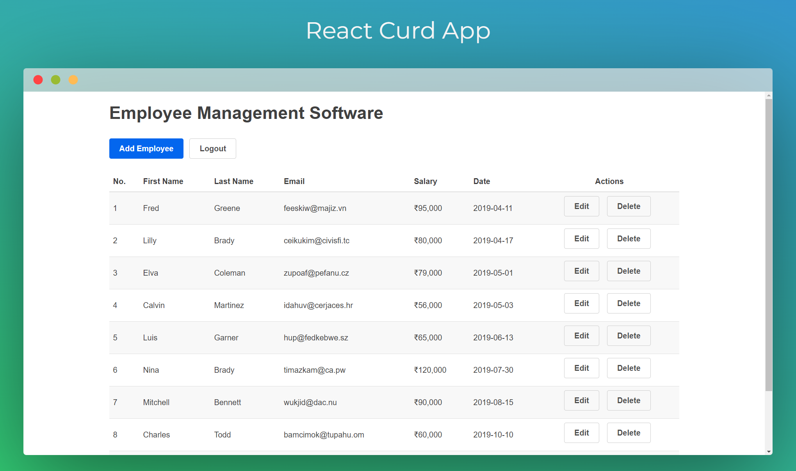

<!--<h1 align="center">
  <a href="https://hilarious-haupia-a26180.netlify.app/">
    React Curd App
  </a>
</h1>
-->


# React Curd App [](https://app.netlify.com/sites/hilarious-haupia-a26180/deploys)

A simple and beautiful [CRUD](https://www.codecademy.com/articles/what-is-crud) application built with [React](https://reactjs.org).

## Live Demo
You can explore the **live demo** of this Todo App by visiting [here](https://hilarious-haupia-a26180.netlify.app/)

## Project Description

A web application built with React.js that allows users to perform CRUD (Create, Read, Update, Delete) operations on employee records. The project also incorporates Primitive UI for a minimalist and responsive design, and SweetAlert2 for enhanced alert notifications. Additionally, the application includes user authentication functionality access to the CRUD operations.

## Technologies Used

- [React](http://reactjs.org) : A popular JavaScript library for building user interfaces, providing a fast and efficient way to develop interactive applications.
- [Primitive UI](https://taniarascia.github.io/primitive) : A  minimalist React component library for building simple and clean user interfaces.
- [SweetAlert2](https://sweetalert2.github.io) : A customizable and responsive alert library for JavaScript applications, enhancing the default browser alerts.

## Tools Used

The following tools were used in the development of this project:

- **Code Editor**: [Visual Studio Code (VS Code)](https://code.visualstudio.com/) was used as the code editor.

## Visual Studio Code Extensions

To enhance your development experience, the following Visual Studio Code extensions were used in this project:

- **ES7+ React/Redux/React-Native snippets**: Provides helpful code snippets for React, Redux, and React Native development.
- **ESLint**: A linter that helps maintain code quality and style.
- **GitHub Theme (Default)**: The GitHub-inspired theme for a clean coding interface.
- **Prettier - Code formatter**: Ensures consistent code formatting and style.

## Development

To get a local copy of the code, clone it using git:

```bash
git clone https://github.com/aditya-armal/react-crud.git
cd crud-app
```

Install dependencies:

```bash
npm install
```

Now, you can start a local web server by running:

```bash
npm start
```

and then you can open http://localhost:3000 to view it in the browser.

### Available Scripts

| Script        | Description                                                             |
| ------------- | ----------------------------------------------------------------------- |
| npm start     | Runs the app in the development mode.                                   |
| npm test      | Launches the test runner in the interactive watch mode.                 |
| npm run build | Builds the app for production to the `build` folder.                    |
| npm run eject | This command will remove the single build dependency from your project. |

